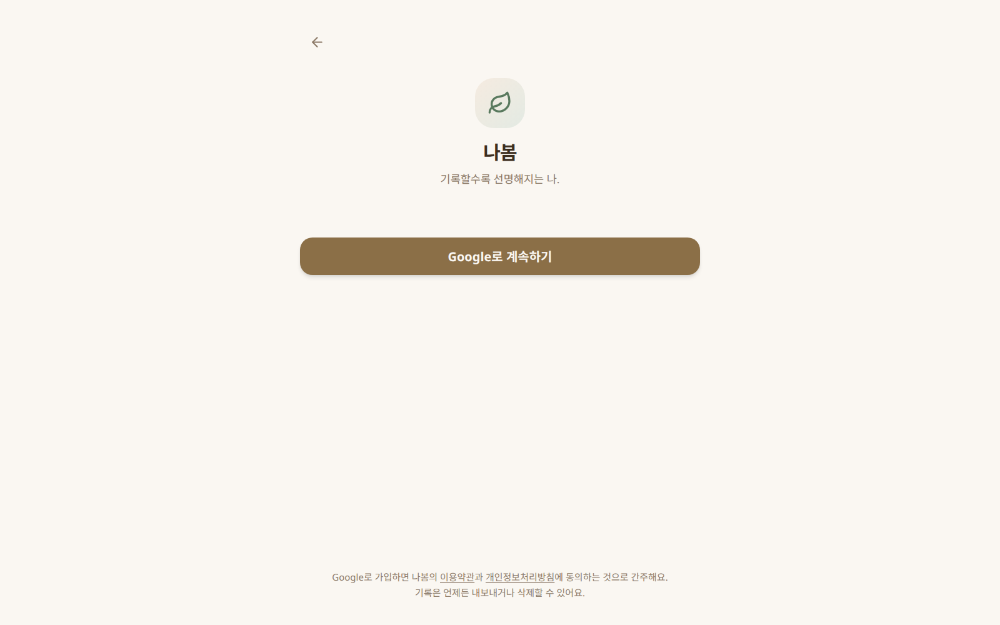
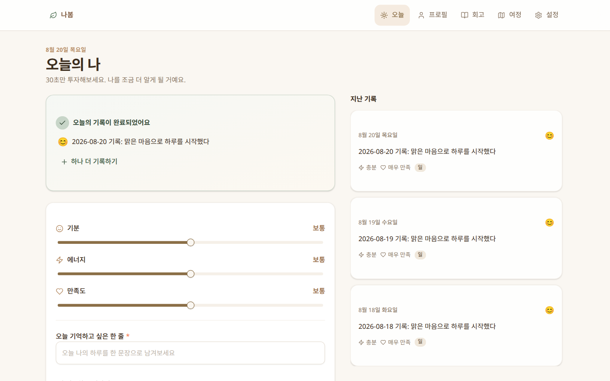
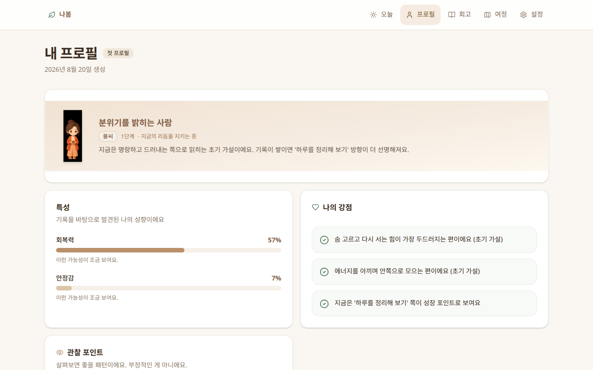
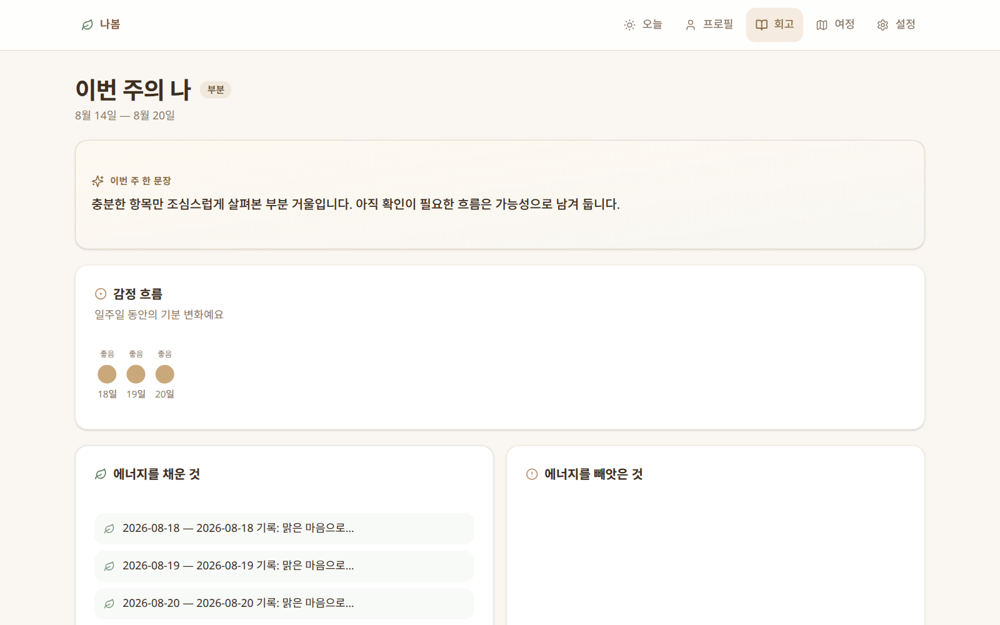
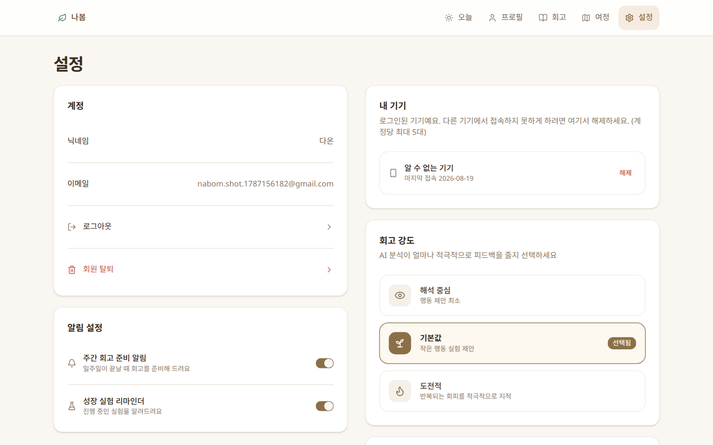

<div align="center">

# 🌿 나봄 · NABOM

### 기록할수록 선명해지는 나.

짧은 기록을 꾸준히 남기면, 시간에 따라 변화하는 **Living Profile**이 선명해집니다.
주간 거울과 작은 실험으로, 다음 한 걸음을 스스로 선택하게 도와주는 자기기록 서비스입니다.

[🌐 nabom.ponslink.com](https://nabom.ponslink.com) · Phase 1 Alpha

</div>

---

## 🖼️ 화면

| 랜딩 | 로그인 |
|---|---|
|  |  |

| 오늘의 나 | 내 프로필 |
|---|---|
|  |  |

| 주간 거울 | 설정 |
|---|---|
|  |  |

---

## ✨ 핵심 기능

- **오늘의 나** — 기분·에너지·만족도와 한 줄 기록으로 30초 체크인. 저장 직후 짧은 피드백과 함께 지난 기록을 쌓아갑니다.
- **Living Profile** — 생년월일 기반 초기 가설 프로필. 기록이 쌓이면 특성 값이 실제 삶에 맞춰 조정되고, 캐릭터 비주얼도 함께 변화합니다.
- **주간 거울 (Weekly Mirror)** — 일주일 기록이 모이면 감정 흐름·패턴·가설·작은 실험을 제안합니다.
- **나의 여정** — 프로필 버전의 변화를 시간순으로 확인합니다.
- **관계·인사이트 그룹** — 동의 기반으로 서로의 프로필 신호를 주고받는 관계 성장 (Phase 2).
- **NFC 키링** — 기록 공간으로의 물리적 진입점.
- **데이터 주권** — 전체 데이터 내보내기, 기록 삭제, 기기 관리, 투명한 분석 방법 고지.

> 모든 분석은 **확정적 판단이 아닌 가설**로 표현되며, 사용자가 직접 확인·수정할 수 있습니다.

---

## 🛠️ 기술 스택


| 영역 | 구성 |
|---|---|
| **프론트엔드** | Next.js 16 (App Router) · React 19 · Zustand · framer-motion · Radix UI · Tailwind CSS 4 |
| **백엔드** | FastAPI 단일 파사드 (계정·기록·프로필·회고·관계·NFC 라우트) |
| **분석 엔진** | 사주 엔진 (출생 기반 초기 가설) · 주역 엔진 (주간 회고 통찰) — 내부 HTTP로 분리 |
| **데이터** | PostgreSQL (기록 저장) · Redis (속도 제한·세션 큐) |
| **배포** | Docker Compose · nginx 리버스 프록시 · Cloudflare (HTML no-store, 정적 에셋 immutable) |

---

## 🏗️ 아키텍처

```
Browser ──► Cloudflare ──► nginx
                              ├── /api/*      → FastAPI facade (nabom-api)
                              │                   ├── 사주 엔진 (출생 기반 프로필 가설)
                              │                   └── 주역 엔진 (주간 회고)
                              └── /*          → Next.js standalone (nabom-web)
```

- **단일 파사드 API** — 프론트엔드는 오직 `/api/v1/*` 만 호출합니다. 분석 엔진의 원문(명리·용신 등)은 사용자에게 노출되지 않습니다.
- **기록 → 프로필 순환** — `일일 기록 → 주간 패턴 → 프로필 버전 제안 → 사용자 확인` 의 closed loop.
- **동의 기반 공유** — 관계·그룹 기능은 명시적 동의가 있어야만 프로필 신호가 공유됩니다.

---

## 🚀 로컬 실행

```bash
# 1) 프론트엔드
cd frontend
npm install
npm run dev          # http://localhost:3000

# 2) 백엔드 + 엔진 (별도 터미널)
cd backend/nabom-api
pip install -r ../requirements.txt
python -m uvicorn main:app --port 8080
```

> 백엔드 저장소 드라이버 기본값은 파일 기반이며, `NABOM_STORE_DRIVER=postgres` 일 때 PostgreSQL을 사용합니다.
> Google 로그인 사용 시 `.env`에 `NABOM_GOOGLE_CLIENT_ID/SECRET/REDIRECT_URI` 를 설정하세요 (`backend/.env.example` 참고).

---

## 🐳 배포

```bash
# 운영 스택 (postgres + redis + backend + web)
cp .env.example .env   # NABOM_DB_PASSWORD 등 설정
docker compose up -d --build
```

- nginx 사이트 설정: [`deploy/nginx-nabom.conf`](deploy/nginx-nabom.conf) — HTML `no-store` / 정적 에셋 immutable
- **Cloudflare 배포 후 캐시 퍼지 필수** — `prefix` 퍼지 (`nabom.ponslink.com/`)를 사용하세요. `*.ponslink.com` 와일드카드 레코드 때문에 hosts 퍼지는 무효입니다.

---

## 📁 구조

```
├── frontend/          # Next.js 앱 (App Router, src/app/*/page.tsx = 뷰 라우트)
│   └── src/
│       ├── app/       # /today /profile /mirror /journey /settings ...
│       ├── components/nabom/   # AppShell · 뷰 컴포넌트
│       ├── store/     # Zustand 전역 상태 (세션·기록·뷰 동기화)
│       └── lib/       # API 클라이언트 · 라우트 매핑 · 날짜 유틸
├── backend/
│   ├── nabom-api/     # FastAPI 파사드 (accounts, living, relations, nfc, admin)
│   ├── saju-engine/   # 사주 분석 엔진 (출생 기반 초기 가설)
│   ├── iching-engine/ # 주역 엔진 (주간 회고 통찰)
│   └── tests/         # pytest 통합·보안 테스트
├── deploy/            # nginx 설정
└── docs/              # 설계 문서 · UI 레퍼런스 · 스크린샷
```

---

## 🧪 테스트

```bash
cd backend/nabom-api && pytest ../tests -q
```

운영 QA (렌더링·기능 E2E) 결과와 배포 노트는 [Obsidian 볼트 보고서](https://github.com/DeclanJeon/nabom)의 커밋 기록에서 확인할 수 있습니다.

---

## ⚖️ 주의

- 본 서비스의 프로필·회고는 **자기관찰용 가설**이며, 의료·법률·재무·치료적 판단이 아닙니다.
- Phase 1 Alpha — 일부 화면과 관계/그룹 기능은 순차 확장 중입니다.
